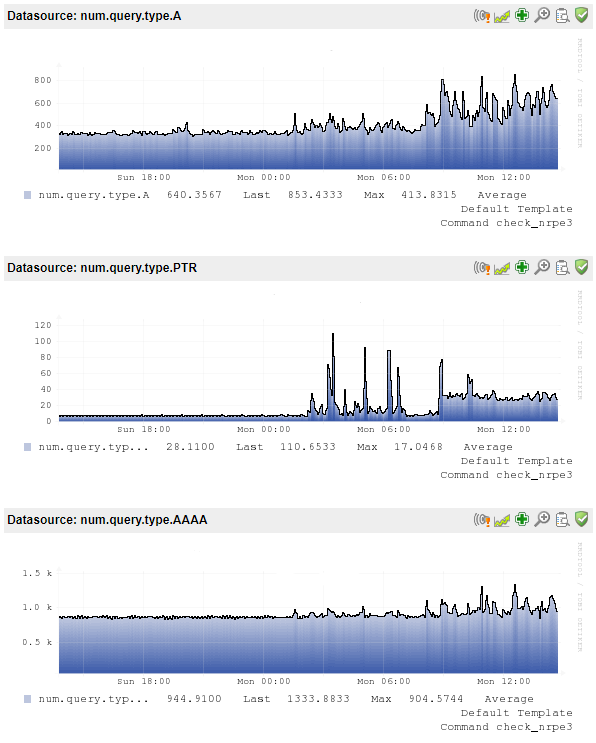

# check_unbound-ng

This is a script for monitoring [Unbound](https://nlnetlabs.nl/projects/unbound/about/) DNS resolvers.

There was already a script named check_unbound which didn't give the metrics I was interested in, so I wrote a new one.  
I didn't want to confuse my new script with the original so I added "-ng" to the name of my script.

The script uses unbound-control to check that Unbound is running.  
Then it runs unbound-control stats to get the statistics.  
These are the statistics shown:
```
total.num.queries
total.num.queries_ip_ratelimited
total.num.cachehits
total.num.cachemiss
total.num.prefetch
total.num.zero_ttl
total.num.recursivereplies
total.requestlist.avg
total.requestlist.max
total.requestlist.overwritten
total.requestlist.exceeded
total.requestlist.current.all
total.requestlist.current.user
total.tcpusage
mem.cache.rrset
mem.cache.message
mem.mod.iterator
mem.mod.validator
mem.mod.respip
mem.mod.subnet
mem.mod.ipsecmod
num.query.type.A
num.query.type.SRV
num.query.class.IN
num.query.opcode.QUERY
num.query.tcp
num.query.tcpout
num.query.ipv6
num.query.flags.QR
num.query.flags.AA
num.query.flags.TC
num.query.flags.RD
num.query.flags.RA
num.query.flags.Z
num.query.flags.AD
num.query.flags.CD
num.query.edns.present
num.query.edns.DO
num.answer.rcode.NOERROR
num.answer.rcode.FORMERR
num.answer.rcode.SERVFAIL
num.answer.rcode.NXDOMAIN
num.answer.rcode.NOTIMPL
num.answer.rcode.REFUSED
num.query.ratelimited
num.answer.secure
num.answer.bogus
num.rrset.bogus
unwanted.queries
unwanted.replies
msg.cache.count
rrset.cache.count
infra.cache.count
key.cache.count
```
An explanation for all the values can be found in the man page for [Unbound-control](https://nlnetlabs.nl/documentation/unbound/unbound-control/).

I have tested the script with Op5 Monitor. It should work with other Nagios compatible products as well.

Note that you need to run check_nrpe 3 or later.
Older versions of check_nrpe has a limitation of 1024 bytes of output. This plugin outputs usually more than that.

### Example

```
check_nrpe -s -H 10.10.10.10 -c check_unbound
Result code: OK
Unbound OK | total.num.queries=214; total.num.queries_ip_ratelimited=0; total.num.cachehits=36; total.num.cachemiss=178; total.num.prefetch=0; total.num.zero_ttl=0; total.num.recursivereplies=180; total.requestlist.avg=2.96067; total.requestlist.max=16; total.requestlist.overwritten=0; total.requestlist.exceeded=0; total.requestlist.current.all=0; total.requestlist.current.user=0; total.tcpusage=0; mem.cache.rrset=5380072; mem.cache.message=2825891; mem.mod.iterator=16588; mem.mod.validator=545228; mem.mod.respip=0; mem.mod.subnet=272632; mem.mod.ipsecmod=0; num.query.type.A=89; num.query.type.AAAA=123; num.query.type.SRV=2; num.query.class.IN=214; num.query.opcode.QUERY=214; num.query.tcp=0; num.query.tcpout=2; num.query.ipv6=0; num.query.flags.QR=0; num.query.flags.AA=0; num.query.flags.TC=0; num.query.flags.RD=214; num.query.flags.RA=0; num.query.flags.Z=0; num.query.flags.AD=0; num.query.flags.CD=0; num.query.edns.present=206; num.query.edns.DO=0; num.answer.rcode.NOERROR=213; num.answer.rcode.FORMERR=0;
```




### Instructions

Enable statistics in Unbound by adding the following in `/etc/unbound/unbound.conf`
```
server:
    statistics-interval: 0
    extended-statistics: yes
    statistics-cumulative: no
```
and
```
remote-control:
    control-enable: yes
    control-interface: 127.0.0.1
```
Restart Unbound.

Install nrpe on the server running unbound in case you don't already have it.
Copy `check_unbound-ng.sh` to the server running unbound in for example `/usr/lib64/nagios/plugins/`
Configure nrpe and add a new command in `/etc/nagios/nrpe.cfg`
```
command[check_unbound]=/usr/lib64/nagios/plugins/check_unbound-ng.sh
```
Restart nrpe.

The script `check_unbound-ng.sh` uses the command `/usr/sbin/unbound-control` which needs root priviledges.
The most secure way to do that is to give nrpe root priviledges executing unbound-control using sudo.
Run visudo as root and add the following:
```
nrpe    ALL=(root)      NOPASSWD: /usr/sbin/unbound-control
Defaults:nrpe !requiretty
```

Configure your monitoring server to use check_nrpe to query nrpe. 

___

Licensed under the [__Apache License Version 2.0__](https://www.apache.org/licenses/LICENSE-2.0)

Written by __farid@joubbi.se__

http://www.joubbi.se/monitoring.html

